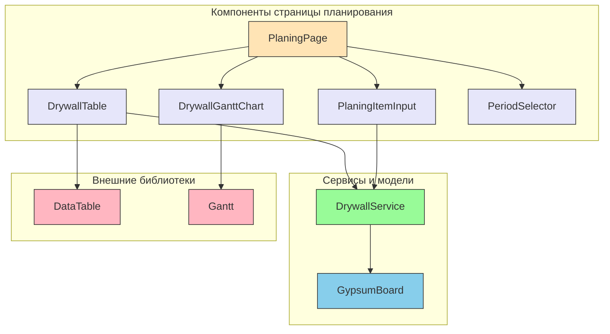
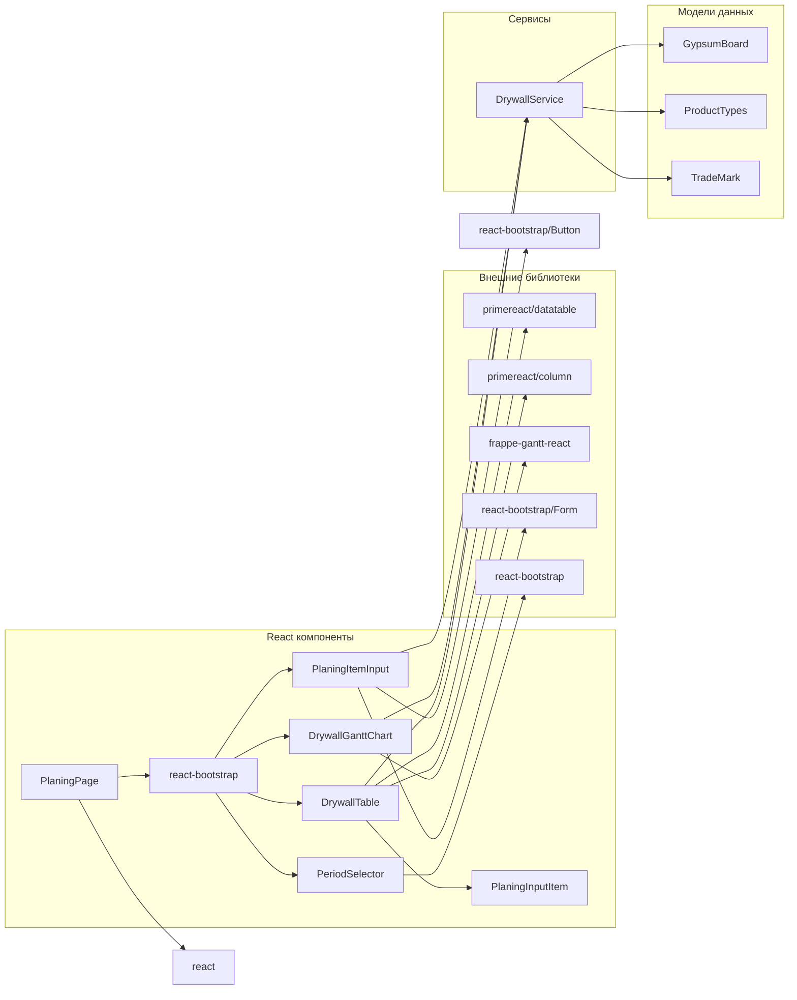

# Архитектурная диаграмма компонентов для диаграммы Ганта Drywall

## Обзор
Эта диаграмма показывает архитектуру компонентов для реализации диаграммы Ганта в контексте страницы планирования производства гипсокартона.

## Диаграмма компонентов

## Описание компонентов

### Основные компоненты страницы планирования
- **PlaningPage** - Основной компонент страницы, координирующий работу всех остальных компонентов
- **DrywallTable** - Компонент для отображения данных в табличном виде
- **DrywallGanttChart** - Компонент для отображения данных в виде диаграммы Ганта
- **PlaningItemInput** - Компонент для ввода новых элементов планирования
- **PeriodSelector** - Компонент для выбора периода отображения данных

### Сервисы и модели
- **DrywallService** - Сервис для работы с данными элементов планирования
- **GypsumBoard** - Модель данных гипсокартона

### Внешние библиотеки
- **DataTable** - Компонент таблицы из библиотеки PrimeReact
- **Gantt** - Компонент диаграммы Ганта из библиотеки frappe-gantt-react

## Потоки данных

1. **PlaningPage** координирует работу всех компонентов и управляет состоянием данных
2. **DrywallTable** и **DrywallGanttChart** получают данные от **PlaningPage**
3. **PlaningItemInput** передает новые данные в **DrywallService**
4. **DrywallService** управляет данными и передает их обратно в **DrywallTable**
5. **DrywallTable** передает обновленные данные в **PlaningPage** через callback
6. **PlaningPage** передает данные в **DrywallGanttChart** для отображения

## Зависимости

## Расширяемость

Архитектура позволяет легко расширять функциональность:

1. **Добавление новых типов визуализации** - можно добавить дополнительные компоненты диаграмм
2. **Расширение данных** - можно добавить новые поля в модель DrywallItem
3. **Интеграция с другими сервисами** - DrywallService можно расширить для работы с другими источниками данных
4. **Кастомизация внешнего вида** - каждый компонент может быть стилизован независимо

## Точки расширения

1. **DrywallService** - может быть расширен для работы с API или другими источниками данных
2. **DrywallGanttChart** - может быть кастомизирован для отображения дополнительной информации
3. **PlaningPage** - может быть расширена для добавления новых режимов отображения
4. **PlaningItemInput** - может быть расширен для добавления новых полей ввода