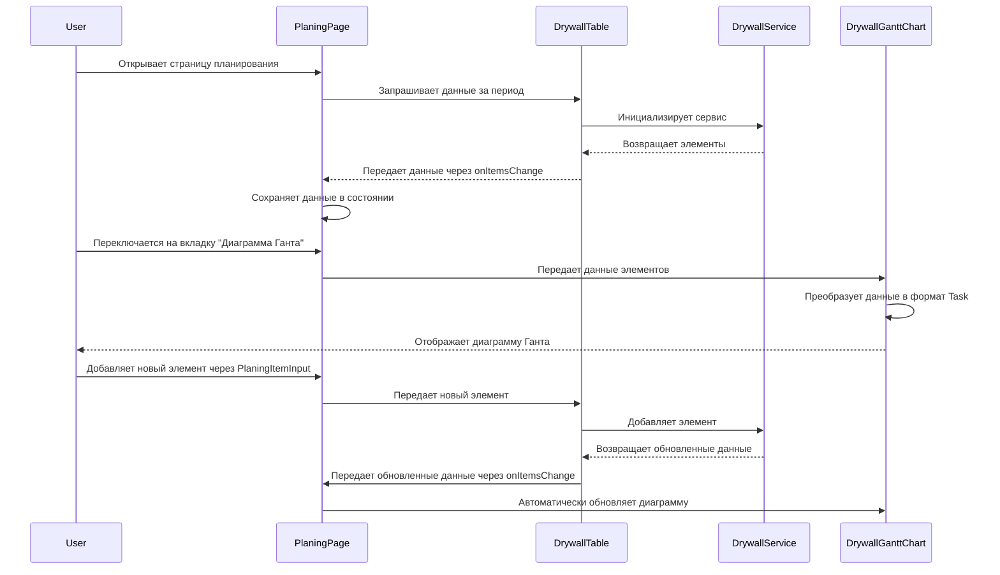

# Диаграмма последовательности для компонента диаграммы Ганта Drywall

## Обзор
Эта диаграмма последовательности показывает взаимодействие между компонентами при отображении диаграммы Ганта для таблицы DrywallTable.

## Диаграмма последовательности

## Описание компонентов

1. **User** - Пользователь, взаимодействующий с интерфейсом
2. **PlaningPage** - Основная страница планирования, координирующая работу всех компонентов
3. **DrywallTable** - Компонент таблицы, отображающий данные в табличном виде
4. **DrywallService** - Сервис для работы с данными элементов планирования
5. **DrywallGanttChart** - Компонент диаграммы Ганта, отображающий данные в виде диаграммы

## Поток данных

1. При загрузке страницы PlaningPage запрашивает данные у DrywallTable
2. DrywallTable получает данные от DrywallService и передает их PlaningPage
3. PlaningPage сохраняет данные в своем состоянии
4. При переключении на вкладку диаграммы Ганта, данные передаются в DrywallGanttChart
5. DrywallGanttChart преобразует данные в формат, необходимый для отображения диаграммы
6. При добавлении/изменении данных поток обновляется автоматически

## Взаимодействие пользователя

1. Пользователь открывает страницу планирования
2. Пользователь может переключаться между таблицей и диаграммой Ганта
3. Пользователь может добавлять новые элементы через PlaningItemInput
4. Изменения автоматически отображаются как в таблице, так и в диаграмме Ганта